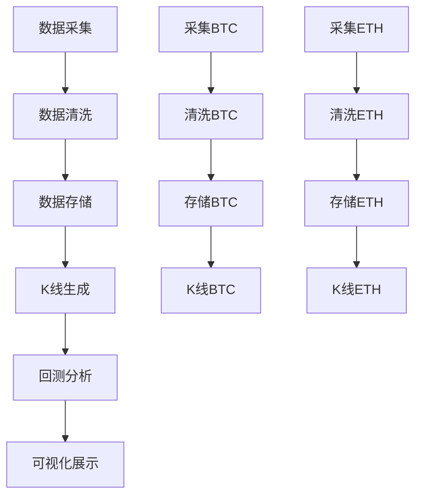

# PredictLab 任务调度系统

## 📋 概述

PredictLab 任务调度系统提供完整的数据管道编排解决方案，支持从数据采集到分析可视化的全流程自动化执行。系统采用异步架构，支持并发执行、依赖管理和错误处理，确保数据处理流程的高效和可靠。

## 🏗️ 系统架构

### 核心组件

#### 1. 任务调度器 (`task_scheduler.py`)
```python
DataPipelineScheduler
├── 任务定义 (Task)
├── 依赖管理 (拓扑排序)
├── 异步执行引擎
├── 错误处理和重试
└── 状态监控
```

#### 2. 异步管道运行器 (`async_pipeline_runner.py`)
```python
AsyncPipelineRunner
├── 完整管道执行
├── 部分管道执行
├── 并发控制
└── 结果统计
```

#### 3. Airflow DAG (`airflow_pipeline_dag.py`)
```python
Airflow 数据管道
├── 定时调度
├── 分布式执行
├── 监控告警
└── 生产环境支持
```

## 🔄 执行流程

### 数据管道标准流程
```
数据采集 → 数据清洗 → 数据存储 → K线生成 → 回测分析 → 可视化展示
     ↓         ↓         ↓         ↓         ↓         ↓
   并发执行  依赖校验  数据验证  多周期生成 策略评估 图表输出
```

### 任务依赖关系


## ⚙️ 核心特性

### 异步并发执行
- **信号量控制**: 限制最大并发任务数
- **资源管理**: 自动释放和重用资源
- **性能优化**: 独立任务并行处理

### 依赖管理和拓扑排序
- **自动排序**: Kahn算法实现拓扑排序
- **依赖校验**: 执行前检查依赖状态
- **级联控制**: 上游失败自动跳过下游

### 错误处理和重试
- **自动重试**: 可配置重试次数和延迟
- **指数退避**: 重试间隔逐渐增加
- **错误隔离**: 单任务失败不影响其他任务
- **关键任务**: 可标记关键任务，失败时终止整个流程

### 状态监控和报告
- **实时状态**: 执行进度和状态跟踪
- **性能统计**: 执行时间、成功率等指标
- **错误报告**: 详细的失败原因和堆栈信息

## 🚀 使用方法

### 基本用法

#### 1. 创建和执行管道
```python
from modules.scheduler.task_scheduler import DataPipelineScheduler

# 创建调度器
scheduler = DataPipelineScheduler()

# 配置管道
pipeline_config = {
    'symbols': ['BTC_PRICE', 'ETH_PRICE'],
    'source_types': ['predict'],
    'intervals': ['1h', '1d'],
    'days_back': 7
}

# 创建管道
scheduler.create_data_pipeline(pipeline_config)

# 执行管道
results = await scheduler.execute_pipeline(max_concurrent=3)
```

#### 2. 自定义任务
```python
from modules.scheduler.task_scheduler import Task

# 定义任务
task = Task(
    task_id="my_custom_task",
    name="自定义任务",
    func=my_async_function,
    args=[arg1, arg2],
    kwargs={'key': 'value'},
    dependencies=['upstream_task'],
    max_retries=3,
    retry_delay=1.0,
    timeout=300,
    critical=True
)

# 添加到调度器
scheduler.add_task(task)
```

#### 3. 监控执行状态
```python
# 获取实时状态
status = scheduler.get_pipeline_status()
print(f"进度: {status['progress']:.1%}")
print(f"状态分布: {status['status_breakdown']}")

# 等待执行完成
results = await scheduler.execute_pipeline()
```

### 高级用法

#### 部分管道执行
```python
from modules.scheduler.async_pipeline_runner import AsyncPipelineRunner

runner = AsyncPipelineRunner()

# 只执行到K线生成阶段
result = await runner.run_partial_pipeline('kline', ['BTC_PRICE'])

# 执行完整管道
result = await runner.run_pipeline(max_concurrent=3)
```

#### 命令行执行
```bash
# 运行完整管道
python main.py --pipeline --concurrent 3

# 运行到指定阶段
python main.py --pipeline-stage backtest --symbols BTC_PRICE ETH_PRICE

# 运行演示
python pipeline_demo.py
```

## 🔧 配置选项

### 管道配置
```python
pipeline_config = {
    'symbols': ['BTC_PRICE', 'ETH_PRICE'],      # 处理的资产列表
    'source_types': ['predict', 'polymarket'], # 数据源类型
    'intervals': ['1h', '4h', '1d'],           # K线时间间隔
    'days_back': 7,                            # 处理最近N天的数据
}
```

### 任务配置
```python
task_config = {
    'max_retries': 3,       # 最大重试次数
    'retry_delay': 1.0,     # 初始重试延迟(秒)
    'timeout': 300,         # 任务超时时间(秒)
    'critical': False,      # 是否为关键任务
}
```

## 📊 监控和调试

### 执行状态查询
```python
# 获取管道状态
status = scheduler.get_pipeline_status()

# 包含的信息
{
    'total_tasks': 15,           # 总任务数
    'completed_tasks': 12,       # 已完成任务数
    'progress': 0.8,            # 完成进度 (0-1)
    'status_breakdown': {       # 状态分布
        'success': 10,
        'failed': 1,
        'running': 1,
        'pending': 3
    },
    'task_results': {           # 详细结果
        'task_id': {
            'status': 'success',
            'duration': 45.2,
            'error': None
        }
    }
}
```

### 日志和调试
```python
# 系统使用 loguru 进行日志记录
# 日志级别: DEBUG, INFO, WARNING, ERROR

# 查看详细日志
logger.info("任务开始执行")
logger.error("任务执行失败", exc_info=True)

# 性能监控
start_time = time.time()
# 执行任务
duration = time.time() - start_time
logger.info(f"任务完成，耗时: {duration:.2f}秒")
```

### 错误排查
```python
# 检查依赖关系
try:
    scheduler.create_data_pipeline(config)
except Exception as e:
    logger.error("管道创建失败，可能是依赖配置错误")

# 查看失败任务详情
for task_id, result in results.items():
    if result.status == TaskStatus.FAILED:
        logger.error(f"任务失败: {task_id}, 错误: {result.error}")
```

## 🔄 与 Airflow 集成

### Airflow DAG 配置
```python
# 在 airflow_pipeline_dag.py 中配置
dag_config = {
    'schedule_interval': '0 */4 * * *',  # 每4小时执行
    'max_active_runs': 1,                # 同时只运行一个实例
    'catchup': False,                    # 不补跑历史任务
    'retries': 3,                        # 任务失败重试次数
    'retry_delay': timedelta(minutes=5), # 重试间隔
}
```

### 生产环境部署
```bash
# 1. 配置 Airflow 连接
airflow connections add 'predictlab_db' \
    --conn-type 'postgres' \
    --conn-host 'your-db-host' \
    --conn-login 'your-username' \
    --conn-password 'your-password'

# 2. 启动 Airflow
airflow scheduler
airflow webserver

# 3. 监控 DAG 执行
# 访问 Airflow Web UI 查看任务状态
```

## 🛡️ 错误处理策略

### 重试机制
- **固定重试**: 网络超时等临时错误
- **指数退避**: API限流等需要等待的错误
- **条件重试**: 基于错误类型的智能重试

### 故障隔离
- **单任务失败**: 不影响其他任务执行
- **关键任务**: 标记重要任务，失败时可选择终止整个流程
- **资源清理**: 确保失败任务正确释放资源

### 数据一致性
- **事务管理**: 数据库操作使用事务确保一致性
- **回滚机制**: 失败时自动回滚未完成的操作
- **状态同步**: 任务状态与实际执行状态保持同步

## 📈 性能优化

### 并发控制
```python
# 根据系统资源调整并发数
max_concurrent = min(5, len(os.sched_getaffinity(0)))  # CPU核心数
results = await scheduler.execute_pipeline(max_concurrent)
```

### 资源池管理
- **数据库连接池**: SQLAlchemy自动管理连接
- **HTTP客户端**: aiohttp复用连接
- **内存管理**: 大数据分批处理，避免内存溢出

### 监控指标
- **执行时间**: 各阶段耗时统计
- **成功率**: 任务成功率监控
- **资源使用**: CPU/内存使用情况
- **队列长度**: 等待任务队列长度

## 🔧 扩展开发

### 添加新任务类型
```python
class CustomTask:
    async def execute(self, **kwargs):
        # 自定义任务逻辑
        pass

# 注册到调度器
scheduler.add_task(Task(
    task_id="custom_task",
    name="自定义任务",
    func=CustomTask().execute,
    # ... 其他配置
))
```

### 自定义调度策略
```python
class PriorityScheduler(DataPipelineScheduler):
    """基于优先级的调度器"""

    def _topological_sort(self) -> List[str]:
        # 实现优先级排序逻辑
        pass
```

### 分布式执行
```python
# 结合 celery 或 dask 实现分布式执行
from celery import Celery

app = Celery('predictlab')
app.conf.update(
    task_serializer='json',
    accept_content=['json'],
    result_serializer='json',
)

@app.task
def execute_task_async(task_config):
    # 分布式任务执行
    pass
```

## 🎯 最佳实践

### 开发阶段
1. **从小开始**: 先实现单个任务，验证功能
2. **添加监控**: 尽早添加日志和状态监控
3. **测试边界**: 测试各种异常情况和边界条件

### 生产部署
1. **配置管理**: 使用环境变量管理配置
2. **监控告警**: 设置关键指标的告警
3. **备份恢复**: 定期备份数据和配置
4. **性能调优**: 根据实际负载调整并发数和资源配置

### 维护更新
1. **版本控制**: 任务和配置的版本管理
2. **灰度发布**: 新功能先在小范围测试
3. **回滚计划**: 准备快速回滚方案

这个任务调度系统为PredictLab提供了从原型到生产的完整数据管道管理解决方案！ 🎉
